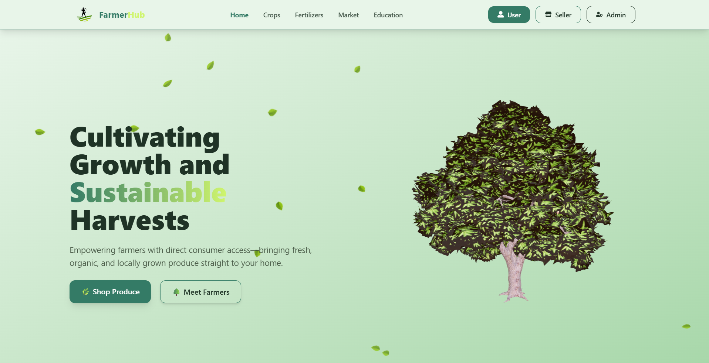
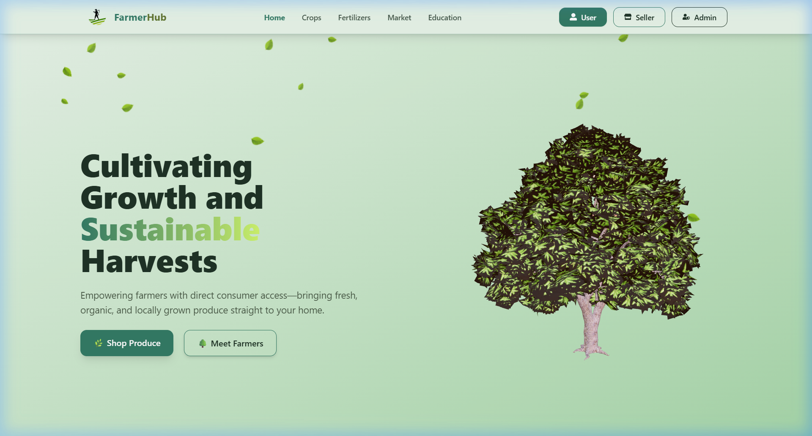
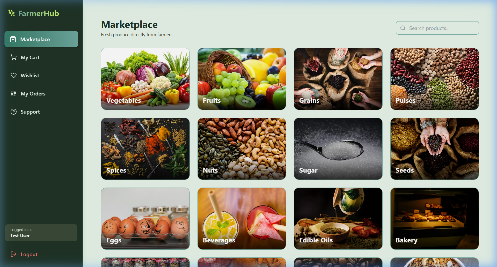
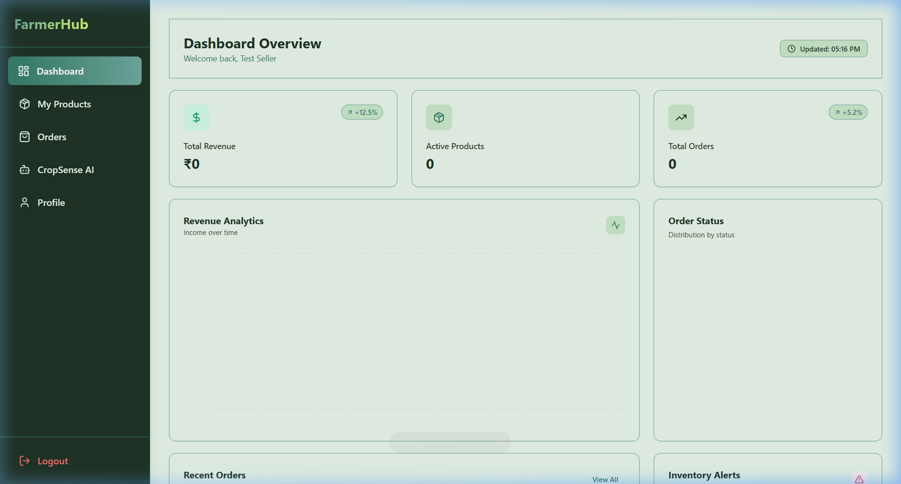
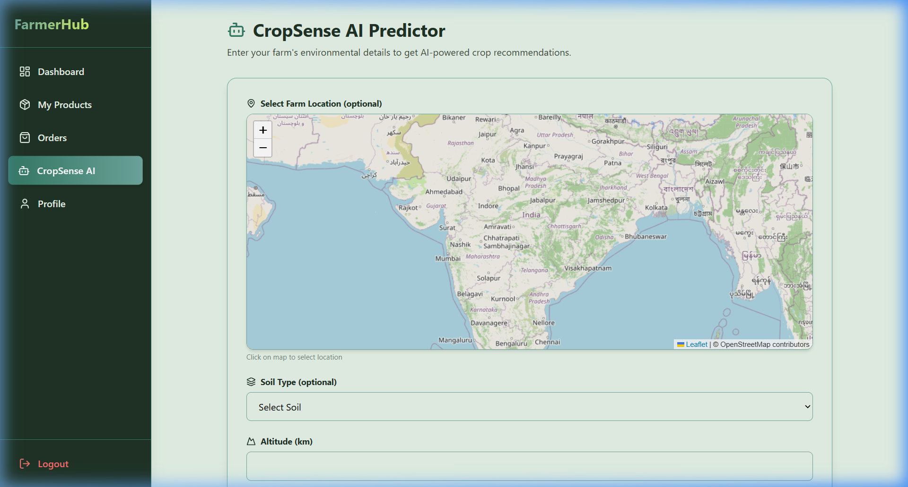
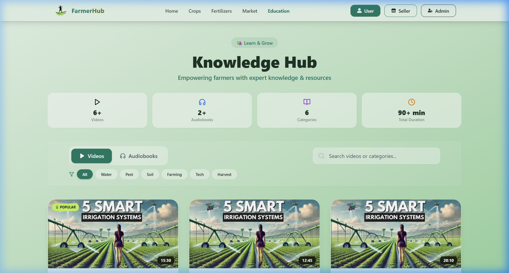
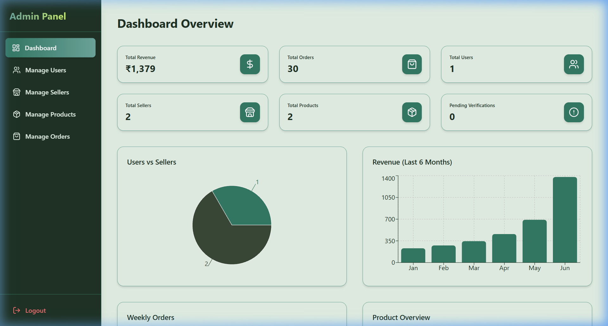
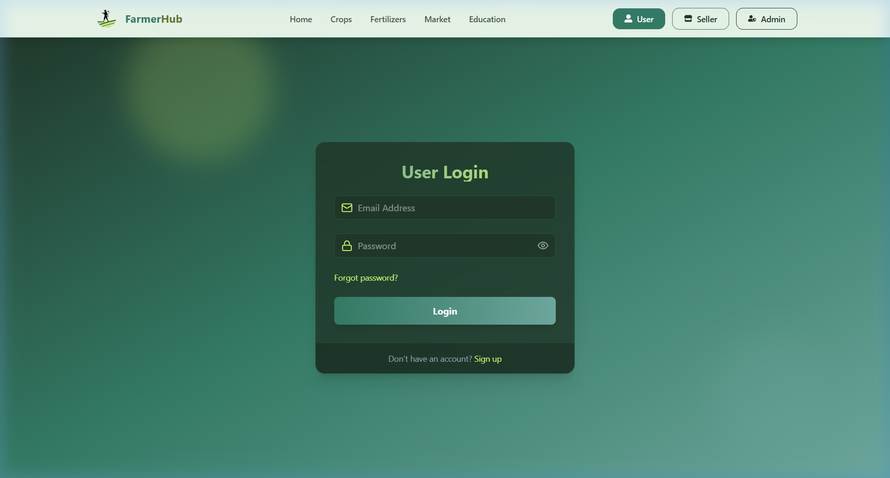
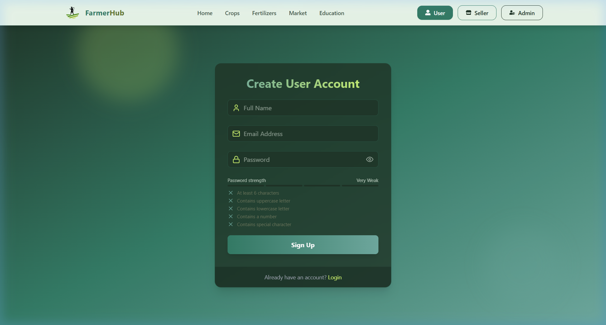

# 🌾 FarmerHub - Farm to Consumer Marketplace

<div align="center">



**Empowering farmers with direct consumer access—bringing fresh, organic, and locally grown produce straight to your home.**

[](https://reactjs.org/)
[](https://nodejs.org/)
[](https://www.mongodb.com/)
[](https://tailwindcss.com/)

</div>

---

## 📋 Table of Contents

- [About](#-about)
- [Features](#-features)
- [Screenshots Showcase](#-screenshots-showcase)
- [Tech Stack](#-tech-stack)
- [Project Structure](#-project-structure)
- [Getting Started](#-getting-started)
- [Environment Variables](#-environment-variables)
- [API Endpoints](#-api-endpoints)
- [Color Palette](#-color-palette)
- [Contributing](#-contributing)
- [License](#-license)

---

## 🌱 About

**FarmerHub** is a full-stack web application that bridges the gap between local farmers and consumers. It provides a platform where farmers can list their fresh produce, and consumers can purchase directly from them—ensuring fair prices for farmers and fresh, organic products for consumers.

The platform features three distinct user roles:
- **Users (Consumers)**: Browse and purchase fresh produce
- **Sellers (Farmers)**: List products, manage orders, and use AI-powered crop assistance
- **Admins**: Manage platform operations, verify sellers, and oversee all activities

---

## ✨ Features

### 👤 User Features
- 🛒 **Marketplace** - Browse and search fresh produce from local farmers
- 🛍️ **Shopping Cart** - Add products and manage purchases
- ❤️ **Wishlist** - Save favorite products for later
- 📦 **Order Tracking** - Track order status in real-time
- 💬 **Support System** - Submit tickets and get help

### 🌾 Seller Features
- 📊 **Dashboard Overview** - Sales analytics and order statistics
- 📝 **Product Management** - Add, edit, and delete product listings
- 📋 **Order Management** - View and update order status
- 🤖 **CropSense AI** - AI-powered crop health analysis and farming tips
- 👤 **Profile Management** - Update business information and settings

### 🔐 Admin Features
- 👥 **User Management** - Manage all users and sellers
- ✅ **Seller Verification** - Verify farmer accounts
- 📈 **Platform Analytics** - Overview of platform metrics
- 🎫 **Support Tickets** - Handle customer support requests

### 🔒 Authentication & Security
- 📧 **Email Verification** - Secure account verification via email
- 🔑 **Password Reset** - Forgot password recovery flow
- 🍪 **JWT Authentication** - Secure token-based authentication
- 🛡️ **Role-Based Access Control** - Protected routes by user role

### 📚 Education Hub
- 🎥 **Video Tutorials** - Agricultural educational content
- 🎧 **Audiobooks** - Listen to farming guides and tips
- 🔍 **Searchable Content** - Find resources by category

---

## 📸 Screenshots Showcase

Here are some highlights of the FarmerHub platform showing the user interfaces for consumers, farmers, and administrators:

### 🏠 Homepage
The landing page features a nature-inspired theme, introducing the marketplace, education hub, and crop analysis tools.


### 🛍️ User Marketplace & Dashboard (Consumer View)
Consumers can browse organic produce, add items to their cart/wishlist, trace orders, and communicate with support.


### 🌾 Seller Dashboard (Farmer View)
Farmers get real-time sales and order analytics, and can easily manage listings, track pending orders, and configure their profile.


### 🤖 CropSense AI (Farming Assistant)
Farmers can upload crop images to get AI-powered health diagnoses, treatment advice, and customized farming tips.


### 📚 Agricultural Education Hub
A resource center offering video tutorials and audiobooks for modern farming practices.


### 🔐 Admin Control Center
Administrators can verify farmer registrations, manage all user accounts, and resolve customer support tickets.


### 🚪 Authentication Portal
Clean and secure interfaces for login and registration across all user roles.
<div align="center">
  <table>
    <tr>
      <td align="center"><b>Login Interface</b></td>
      <td align="center"><b>Signup Interface</b></td>
    </tr>
    <tr>
      <td></td>
      <td></td>
    </tr>
  </table>
</div>

---

## 🛠️ Tech Stack

### Frontend
| Technology | Purpose |
|------------|---------|
| **React 18** | UI Framework |
| **Vite** | Build Tool & Dev Server |
| **Tailwind CSS** | Styling |
| **Framer Motion** | Animations |
| **React Router v6** | Routing |
| **Zustand** | State Management |
| **React Three Fiber** | 3D Graphics (Homepage) |
| **Axios** | HTTP Client |
| **React Hot Toast** | Notifications |
| **Lucide React** | Icons |
| **Recharts** | Charts & Analytics |
| **Leaflet** | Maps Integration |

### Backend
| Technology | Purpose |
|------------|---------|
| **Node.js** | Runtime Environment |
| **Express.js** | Web Framework |
| **MongoDB** | Database |
| **Mongoose** | ODM |
| **JWT** | Authentication |
| **Bcrypt.js** | Password Hashing |
| **Nodemailer** | Email Service |
| **Cloudinary** | Image Storage |
| **Google Generative AI** | AI Features |
| **Express File Upload** | File Handling |

---

## 📁 Project Structure

```
SAI/
├── 📂 backend/
│   ├── 📂 config/           # Configuration files
│   │   ├── cloudinary.js    # Cloudinary setup
│   │   └── emailConfig.js   # Email configuration
│   ├── 📂 controllers/      # Route controllers
│   │   ├── admin.controller.js
│   │   ├── ai.controller.js
│   │   ├── auth.controller.js
│   │   ├── order.controller.js
│   │   ├── product.controller.js
│   │   ├── support.controller.js
│   │   ├── upload.controller.js
│   │   └── wishlist.controller.js
│   ├── 📂 db/               # Database connection
│   │   └── connectDB.js
│   ├── 📂 mailer/           # Email templates & service
│   │   ├── emailTemplate.js
│   │   └── mail.js
│   ├── 📂 middleware/       # Express middleware
│   │   ├── upload.middleware.js
│   │   ├── verifyAdmin.js
│   │   └── verifyAuth.js
│   ├── 📂 models/           # Mongoose models
│   │   ├── account.model.js
│   │   ├── order.model.js
│   │   ├── product.model.js
│   │   └── support.model.js
│   ├── 📂 routes/           # API routes
│   ├── 📂 utils/            # Utility functions
│   ├── index.js             # Server entry point
│   └── package.json
│
├── 📂 frontend/
│   ├── 📂 public/
│   │   └── 📂 assets/       # Static assets
│   ├── 📂 src/
│   │   ├── 📂 components/   # React components
│   │   │   ├── 📂 admin/    # Admin components
│   │   │   ├── 📂 seller/   # Seller components
│   │   │   └── 📂 user/     # User components
│   │   ├── 📂 layouts/      # Layout components
│   │   ├── 📂 pages/        # Page components
│   │   ├── 📂 store/        # Zustand stores
│   │   ├── 📂 utils/        # Utility functions
│   │   ├── App.jsx          # Main app component
│   │   ├── main.jsx         # Entry point
│   │   └── index.css        # Global styles
│   ├── index.html
│   ├── tailwind.config.js
│   ├── vite.config.js
│   └── package.json
│
├── package.json             # Root package.json
└── README.md
```

---

## 🚀 Getting Started

### Prerequisites

- **Node.js** (v18 or higher)
- **npm** or **yarn**
- **MongoDB** (local or Atlas)
- **Cloudinary** account
- **Gmail** account (for email service)

### Installation

1. **Clone the repository**
   ```bash
   git clone https://github.com/anupamraj176/SAI.git
   cd SAI
   ```

2. **Install backend dependencies**
   ```bash
   cd backend
   npm install
   ```

3. **Install frontend dependencies**
   ```bash
   cd ../frontend
   npm install
   ```

4. **Set up environment variables** (see [Environment Variables](#-environment-variables))

5. **Start the development servers**

   **Backend** (from `/backend` directory):
   ```bash
   npm run dev
   ```

   **Frontend** (from `/frontend` directory):
   ```bash
   npm run dev
   ```

6. **Open your browser**
   - Frontend: `http://localhost:5173`
   - Backend API: `http://localhost:5001`

7. **Seed Test Accounts (Optional)**
   To quickly explore different dashboards without manually creating accounts, run the following utility script from the `/backend` directory:
   ```bash
   node scripts/createTestUsers.js
   ```
   This will create three pre-configured, verified test accounts with the password `password123`:
   - **User**: `testuser@example.com`
   - **Seller**: `testseller@example.com`
   - **Admin**: `testadmin@example.com`

---

## 🔐 Environment Variables

Create a `.env` file in the `/backend` directory:

```env
# Server
PORT=5001
NODE_ENV=development

# MongoDB
MONGODB_URL=your_mongodb_connection_string

# JWT
JWT_SECRET=your_jwt_secret_key

# Cloudinary
CLOUD_NAME=your_cloudinary_cloud_name
API_KEY=your_cloudinary_api_key
API_SECRET=your_cloudinary_api_secret

# Email (Gmail)
EMAIL_USER=your_gmail_address
EMAIL_APP_PASSWORD=your_gmail_app_password

# Google AI (for CropSense AI feature)
GEMINI_API_KEY=your_google_generative_ai_key

# Frontend URL (for CORS)
CLIENT_URL=http://localhost:5173
```

---

## ☸️ Kubernetes Deployment

This project includes Kubernetes configurations to run the entire stack (Frontend, Backend, MongoDB, and Persistent Storage) locally or in a cluster.

### 📁 Kubernetes Files Structure
All files are located in the `kubernetes/` folder:
- `namespace.yml` - Defines the isolated `sai-app` namespace.
- `mongodb-pv.yml` & `mongodb-pvc.yml` - Local persistent storage configuration for MongoDB.
- `mongodb-deployment.yml` & `mongodb-service.yml` - MongoDB service and state.
- `backend-configmap.yml` & `secretes.example.yml` - Backend environment settings.
- `backend-deployment.yml` & `backend-service.yml` - Node.js Express server.
- `frontend-deployment.yml` & `frontend-service.yml` - Nginx static server and api proxy.
- `ingress.yml` - Nginx Ingress Controller routing rules (optional).

### 🚀 Getting Started with Kubernetes

#### 1. Setup Local Secrets
Before applying your Kubernetes files, create a copy of the secret template:
```powershell
cp ./kubernetes/secretes.example.yml ./kubernetes/secretes.yml
```
*Note: `kubernetes/secretes.yml` is ignored by Git in `.gitignore` to prevent leaking passwords to GitHub. Update `kubernetes/secretes.yml` with your real Gemini, Gmail, Cloudinary, and Razorpay API secrets before proceeding.*

#### 2. Deploy Everything to Cluster
Apply the manifests to the cluster:
```powershell
# Create namespace
kubectl apply -f .\kubernetes\namespace.yml

# Apply configurations and secrets
kubectl apply -f .\kubernetes\secretes.yml
kubectl apply -f .\kubernetes\backend-configmap.yml

# Apply Database (Persistent Volume -> Claim -> Deployment -> Service)
kubectl apply -f .\kubernetes\mongodb-pv.yml
kubectl apply -f .\kubernetes\mongodb-pvc.yml
kubectl apply -f .\kubernetes\mongodb-deployment.yml
kubectl apply -f .\kubernetes\mongodb-service.yml

# Apply Backend & Frontend services
kubectl apply -f .\kubernetes\backend-deployment.yml
kubectl apply -f .\kubernetes\backend-service.yml
kubectl apply -f .\kubernetes\frontend-deployment.yml
kubectl apply -f .\kubernetes\frontend-service.yml
```

#### 3. Verify System Health
Verify that all services and pods are running correctly:
```powershell
# Check pods (Wait until all show 'Running')
kubectl get pods -n sai-app

# Check services
kubectl get svc -n sai-app
```

#### 4. Access the Application
Since the frontend Nginx is configured to proxy all `/api/*` requests directly to the backend service inside the cluster, **you only need to port-forward the frontend to access the entire application**:

```powershell
kubectl port-forward svc/frontend -n sai-app 30080:80
```
- Open [http://localhost:30080](http://localhost:30080) in your web browser.
- Login, signup, products, and support tickets will route and function correctly.

*(Optional)* If you want to check backend status directly:
```powershell
kubectl port-forward svc/backend -n sai-app 5001:5001
```
Then visit [http://localhost:5001/api/auth/check-auth](http://localhost:5001/api/auth/check-auth) to check API status.

---

## 📡 API Endpoints

### Authentication
| Method | Endpoint | Description |
|--------|----------|-------------|
| POST | `/api/auth/signup` | Register new user |
| POST | `/api/auth/login` | Login user |
| POST | `/api/auth/logout` | Logout user |
| POST | `/api/auth/verify-email` | Verify email |
| POST | `/api/auth/forgot-password` | Request password reset |
| POST | `/api/auth/reset-password/:token` | Reset password |
| GET | `/api/auth/check-auth` | Check authentication status |

### Products
| Method | Endpoint | Description |
|--------|----------|-------------|
| GET | `/api/products` | Get all products |
| GET | `/api/products/:id` | Get product by ID |
| POST | `/api/products` | Create product (Seller) |
| PUT | `/api/products/:id` | Update product (Seller) |
| DELETE | `/api/products/:id` | Delete product (Seller) |

### Orders
| Method | Endpoint | Description |
|--------|----------|-------------|
| GET | `/api/orders` | Get user orders |
| GET | `/api/orders/seller` | Get seller orders |
| POST | `/api/orders` | Create order |
| PUT | `/api/orders/:id/status` | Update order status |

### Support
| Method | Endpoint | Description |
|--------|----------|-------------|
| GET | `/api/support` | Get support tickets |
| POST | `/api/support` | Create support ticket |

### AI
| Method | Endpoint | Description |
|--------|----------|-------------|
| POST | `/api/ai/analyze` | Analyze crop image |

### Admin
| Method | Endpoint | Description |
|--------|----------|-------------|
| GET | `/api/admin/users` | Get all users |
| PUT | `/api/admin/verify-seller/:id` | Verify seller |

---

## 🎨 Color Palette

FarmerHub uses a nature-inspired green color palette that reflects its agricultural theme:

| Color Name | Hex Code | Preview | Usage |
|------------|----------|---------|-------|
| **Evergreen** | `#1F3326` |  | Dark backgrounds, text |
| **Emerald** | `#347B66` |  | Primary buttons, accents |
| **Sage** | `#6FA99F` |  | Secondary elements |
| **Lime Cream** | `#CFF56E` |  | Highlights, CTAs |
| **Forest** | `#3B4A38` |  | Dark secondary |
| **Olive** | `#6B765C` |  | Neutral accents |
| **Pine** | `#1C2D2A` |  | Dark backgrounds |
| **Charcoal** | `#0E1719` |  | Deepest dark |
| **Moss** | `#BABA9E` |  | Light accents |

---

## 🤝 Contributing

Contributions are welcome! Please feel free to submit a Pull Request.

1. Fork the repository
2. Create your feature branch (`git checkout -b feature/AmazingFeature`)
3. Commit your changes (`git commit -m 'Add some AmazingFeature'`)
4. Push to the branch (`git push origin feature/AmazingFeature`)
5. Open a Pull Request

---

## 📄 License

This project is licensed under the ISC License.

---

## 👨‍💻 Author

**Anupam Raj**
- GitHub: [@anupamraj176](https://github.com/anupamraj176)

---

<div align="center">

**🌾 FarmerHub - Connecting Farms to Families 🏠**

Made with ❤️ for farmers everywhere

</div>
